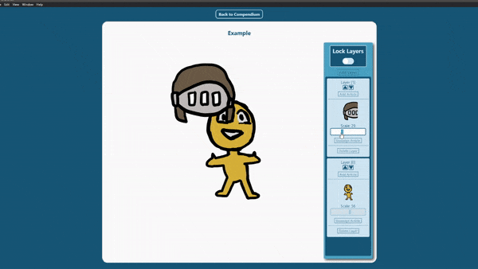

# CharaNav

---
Current Example Build: [Windows](https://drive.google.com/open?id=1oV9UxcGntlthP7aCoi0nOSZamEMA4OlE) 
---
CharaNav is a desktop application built with Electron + NodeJS, React, and SQLite. It is intended as a tool for artists to create character model sheets that you can navigate dynamically. 
- Multiple "compendiums" can be created to store characters for different projects
- Each art asset imported is referred to as an "article," and can be utilized  by any character created in the same compendium
- Images on the character canvas can be scaled and dragged around at the users discretion, the canvas can also be locked to prevent this behavior on accident
- Each article is given a description, clicking on the article on the character canvas or article browse tab will bring the user to the article page and its description
---
## Production Status
- All essential features have been developed
- All CRUD operations are present: compendiums, characters, articles, and layers can all be created, edited, and deleted easily
- This was my first project integrating Electron and React, **all the SQLite functions are currently crammed into the electron.js.** However, my other project [pulseFG]() uses the same technology stack and provides a much better modularized implementation. This project will soon follow suit.
- An example project to demonstrate usage is currently in progress
- *Documentation is currently a work in progress, stay tuned!*
- The DevNotes.md provided in the project houses a lot of my thinking throughout the project.
---
## Installation
- Clone the repository
- Run ```npm install```
- The SQLite native libraries should be rebuilt automatically, if not run ```npm run postinstall``` 
- To build the app for windows run ```npm run electron-pack```
- For more information on building electron apps to other platforms: [Electron Builder](https://www.electron.build/)
---
This application is free open source under [MIT license](https://opensource.org/licenses/MIT).